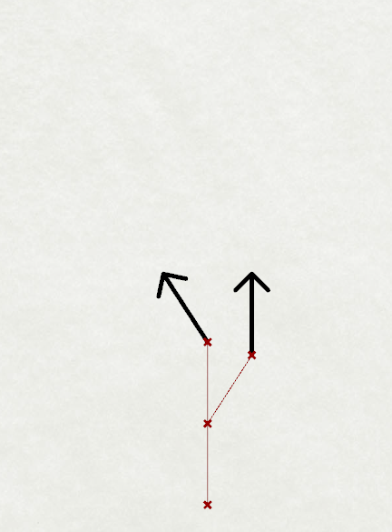
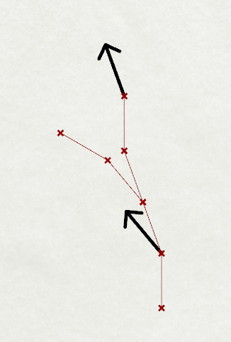

# Mandel Bros. Plumbing
The Mandel Bros. Plumbing Company has been hired to build a new water distribution system. This water distribution system consists of pipes entirely in 2-dimensions, flat on the ground. After analyzing the project requirements, the project lead gives the following instructions:

- On day 0, we will begin the project by placing a single black arrow facing North.
- On each subsequent day, we will perform two operations in this order:
    1. Double the length of each straight section of pipe, and
    1. Replace any black arrow markers with the *Seed Design* for this project.
- On the last day of the project, *after* the two operations above are complete, all black arrows will be removed.

# Example Project
## Day 0 - Mark the Start Point and Direction
The root of the black arrow is at the point (0, 0, 0) and is pointing due North, which corresponds to the positive y-axis.

## Day 1 - Example *Seed Design*

Since there have not been any pipes placed, no pipe length doubling will take place.

A *Seed Design* can be described as being constructed in a series of steps (much like turtle graphics), from a given start point and direction vector. In this case, the start point is (0, 0, 0) and the direction vector is $\vec{(0, 1, 0)}$.

1. Place 1 unit-length of pipe and move forward 1 unit in the current direction.
1. Save the current position and direction in a stack.
1. Place 1 unit-length of pipe and move forward 1 unit in the current direction.
1. Turn left 33°
1. Place a black directional marker for tomorrow.
1. Pop the last saved position and direction, and move back to that position and direction. (This will result in a branch in the piping network.)
1. Turn right 33°
1. Place 1 unit-length of pipe and move forward 1 unit in the current direction.
1. Turn left 33°
1. Place a black directional marker for tomorrow.

## Day 2 - Double Pipe Lengths, and Place New *Seed Designs*

Since there are now pipes, double the length of all existing pipes, leaving the black arrows connected at their relative locations.

Attach new *Seed Designs* in the positions and orientations given by the black arrows.

## End of the Example Project
At the end of this example two-day project, all markers are then removed. The positions of the four ***termination points*** and the one ***origin point*** are given here:

The sorted distances of all four *termination points* from the *origin point* are given in this list:

| Distance |
| --- |
| 5.752918 |
| 5.780893 |
| 5.780893 |
| 5.864018 |

___

The ***truncated median*** distance is defined as the median distance for the termination points, truncated at the tenths place.

**The truncated median distance for this two-day project is `5.7`**.

**The MD5 hash of the truncated median distance for this two-day project is `f1867131d82f2256b4521fe34aec2405`**.

# Problem 1

Provide the **MD5 hash of the truncated median distance** for the following 12-day project.

## Seed design:

Here is the *Seed Design* for this new project, starting at point (0, 0, 0) and direction vector $\vec{(0, 1, 0)}$. 

1. Place 1 unit-length of pipe and move forward 1 unit in the current direction.
1. Turn left **20°**
1. Save the current position and direction in a stack.
1. Turn left **20°**
1. Place a black directional marker for tomorrow.
1. Pop the last saved position and direction, and move back to that position and direction.
1. Place 1 unit-length of pipe and move forward 1 unit in the current direction.
1. Turn left **20°**
1. Save the current position and direction in a stack.
1. Place 1 unit-length of pipe and move forward 1 unit in the current direction.
1. Turn left **20°**
1. Place 1 unit-length of pipe and move forward 1 unit in the current direction.
1. Pop the last saved position and direction, and move back to that position and direction.
1. Turn right **20°**
1. Place 1 unit-length of pipe and move forward 1 unit in the current direction.
1. Turn right **20°**
1. Place 1 unit-length of pipe and move forward 1 unit in the current direction.
1. Turn left **20°**
1. Place a black directional marker for tomorrow.

Complete the project at the ***end of day 12***, and provide the **MD5 hash of the truncated median distance** (as defined above) for all termination points of this piping network.
