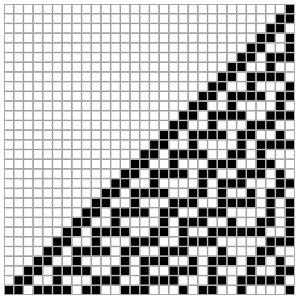

# Cellular Automata

[Cellular Automata](https://mathworld.wolfram.com/CellularAutomaton.html) (CA) are models that graphically display
the state of related cells over discrete time steps.

An [Elementary Cellular Automaton](https://mathworld.wolfram.com/ElementaryCellularAutomaton.html) models a one-dimensional 
arrangement of cells. With each successive time step, that one-dimensional model is transformed.
The model has a starting state at *t*=0.
In this Elementary CA, each cell has one of two states: *on* (black or 1) and *off* (white or 0).
The model's state at *t*>0 is determined by applying a ruleset on the state at *t*-1.
A ruleset defines the state of a cell at time *t* as a function of the state of its left neighbor, itself, and its right neighbor
at time *t*-1.

Here is one example ruleset (called Rule 30):

| Left | Self | Right | Output |
|------|------|-------|--------|
| 0    | 0    | 0     | 0      |
| 0    | 0    | 1     | 1      |
| 0    | 1    | 0     | 1      |
| 0    | 1    | 1     | 1      |
| 1    | 0    | 0     | 1      |
| 1    | 0    | 1     | 0      |
| 1    | 1    | 0     | 0      |
| 1    | 1    | 1     | 0      |

Often, Elementary CAs are displayed as a two-dimensional grid, with the initial state as the top row, 
and each new state added below the previous state.

## Example Elementary CA

Here are 30 iterations of an Elementary CA:

In this example, the model is a set of 30 cells (horizontal), and the time range is from *t*=0 to *t*=29 (vertical).
The initial state is all cells off, except the rightmost. This initial state (*t*=0) can be represented by the binary number:
`00000 00000 00000 00000 00000 00001`, which is of course equal to the decimal value `1`.

One thing to note when updating the model's state: The two end cell's will each be missing one neighbor cell.
The value of these missing neighbor cells should be treated as *off* (0).

The state at *t*=4 is `00000 00000 00000 00000 00000 11001`, or `25` in decimal.
The MD5 hash of `25` is `8e296a067a37563370ded05f5a3bf3ec`.

## Problem 1

If the model and ruleset for the above example were continued, what is the MD5 hash of the decimal value for the model
state at *t*=59?

## Problem 2

A new model of **100** cells is evaluated with a new ruleset.
This model has an initial state with only the rightmost cell on (value = `1`).

Here is the ruleset (Rule 105):

| Left | Self | Right | Output |
|------|------|-------|--------|
| 0    | 0    | 0     | 1      |
| 0    | 0    | 1     | 0      |
| 0    | 1    | 0     | 0      |
| 0    | 1    | 1     | 1      |
| 1    | 0    | 0     | 0      |
| 1    | 0    | 1     | 1      |
| 1    | 1    | 0     | 1      |
| 1    | 1    | 1     | 0      |

What is the MD5 hash of the decimal value for the model state at *t*=999?

## Problem 3

A new model of **300** cells is evaluated with a new ruleset.
This model has an initial state with only the rightmost cell on (value = `1`).

Here is the ruleset (Rule 169):

| Left | Self | Right | Output |
|------|------|-------|--------|
| 0    | 0    | 0     | 1      |
| 0    | 0    | 1     | 0      |
| 0    | 1    | 0     | 0      |
| 0    | 1    | 1     | 1      |
| 1    | 0    | 0     | 0      |
| 1    | 0    | 1     | 1      |
| 1    | 1    | 0     | 0      |
| 1    | 1    | 1     | 1      |

What is the MD5 hash of the decimal value for the model state at *t*=29999?

## Problem 4

A new model of **3000** cells is evaluated with the ruleset for Problem 3 (Rule 169).
This model has an initial state with only the rightmost cell on (value = `1`).

Here is the ruleset (Rule 169):

| Left | Self | Right | Output |
|------|------|-------|--------|
| 0    | 0    | 0     | 1      |
| 0    | 0    | 1     | 0      |
| 0    | 1    | 0     | 0      |
| 0    | 1    | 1     | 1      |
| 1    | 0    | 0     | 0      |
| 1    | 0    | 1     | 1      |
| 1    | 1    | 0     | 0      |
| 1    | 1    | 1     | 1      |

What is the MD5 hash of the decimal value for the model state at *t*=29999?
