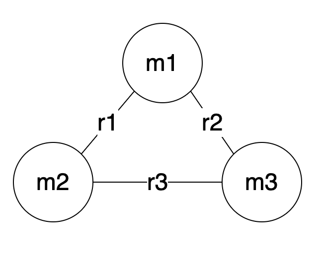

Welcome to the 2023 Software Challenge!

Maximum Attempts 1.
Values Change Daily!!

If you are doing this challenge first, that's great! This is a good place to start. If you have completed one challenge already you're probably going to enjoy the simplicity of this problem.

We are going to solve the 3 Body problem.

Just kidding, we are going to solve the 2 body problem, multiple times, because nothing is moving.

Given a two masses m1 = e = 2.718 and m2 = ϕ = 1.618, calculate the force between them at a distance of r = pi = 3.142 
with Newton's formula and his constant G = 6.674×10−11

F = G*m1*m2/r^2

3 decimal places and the exponent which will be discarded
2.973,-11

In a 3 body problem, the force is with all of them, all the time, three-dimensionally.
Given an extra m3 = 1.414 we can now calculate the force for 3 pairs of masses.
F1 is the force between m1 and m2.
F2 is the force between m1 and m3.
F3 is the force between m2 and m3.

If m3 is at the same distance r=3.142 from both m1 and m2, we get:

F1 = 2.973x10^-11
F2 = 2.598x10^-11
F3 = 1.547x10^-11

Find the appropriate distance(s) where, F1, F2, and F3 are equal, r1 is graphically between m1 and m2, r2 is graphically between m1 and m3, r3 is graphically between m2 and m3 as seen in img.png
The list is provided with input.txt.
For each distance in the input file you must calculate and include the other 2 distances in the output file. For example, when the input file contains r3=11.613 your output file must contain r1=16.100,r2=15.052

This isn't supposed to be tricky, and you can solve it with pencil and paper, or a calculator, or a fancy math processor, or a fancy word predictor; however, there are 100 of them, so beware of cramps!
All values are three non-zero decimal places.
Your answer should be in the form `2adca2ebdaee6d90b32da65a3364db80` which corresponds to the md5 hash of `r1=16.101,r2=15.052,r1=14.166,r3=10.218,r1=13.638,r3=9.837,r1=17.733,r3=12.79,r1=11.818,r3=8.524` as seen in the example file from input_2025-02-01.txt and similar output file.

